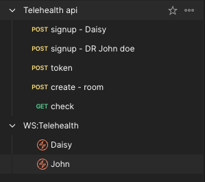
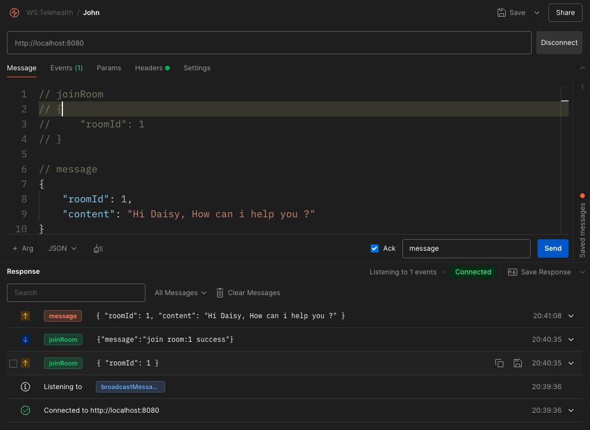

# Telehealth Testing Project
## Startup Project
### Dev Env
```bash
docker compose -f ./compose.dev.yml up -d
```

### Staging Env
```bash
docker compose up -d
```

**Expected state After start the project**
- API and WS will UP and running on url -> **localhost:8080**
- API swagger with be on URL -> **localhost:8080/doc**
- Postman's collection is on folder **./postman**


## Images


---

## Testing steps
- Create user one or multiple users as you like
    - POST: api/v1/auth/signup

- Create room
   - POST: api/v1/auth/rooms

- Use created user {username, password} to **auth** to get **accessToken**
    - POST: api/v1/auth/token

- Copy/Paste the AT to postman socket.io **headers**
    - In headers section: **Add Authorization key**
    - The value will be: **Beaere {access-token}**

---
## Available Events
- **joinRoom**: { roomId: number } (with ack)
- **message**: { roomId: number, content: string }
- **leaveRoom**: { roomId: number }


## Remark
```
All routes and socket events detail will be in ./postman/collection.json
OR swagger
```
